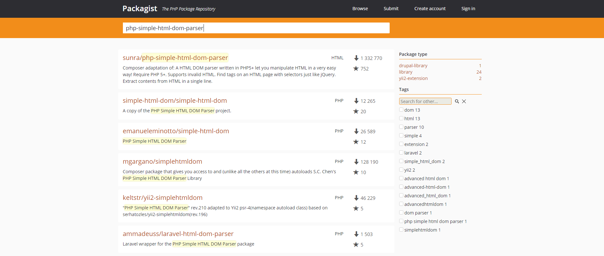
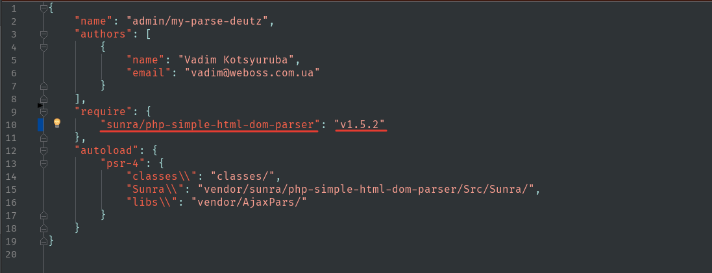
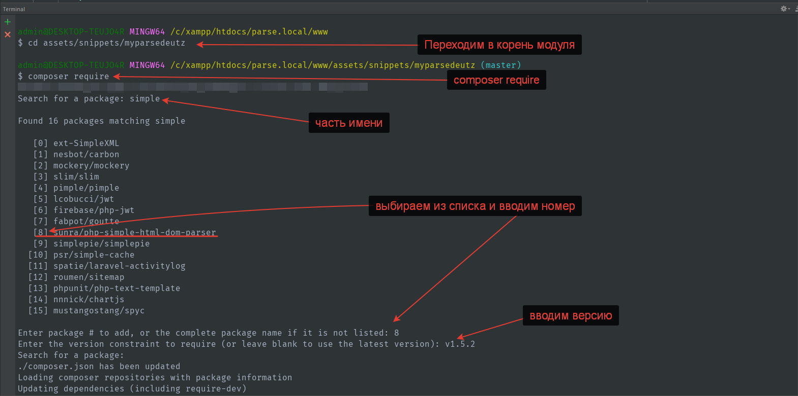

## Загрузка пакетов с packagist.org  
1. Переходим на [packagist.org](https://packagist.org).
2. С помощью поиска ищем нужный пакет.  
Например, нам нужна библиотека: php-simple-html-dom-parser.  
  
Выбираем подходящий нам пакет из списка и переходим на страницу с информацией о нем.  
  
Заходим в файл `composer.json` и в параметре `require` вписываем название и версию нужного нам пакета.  
  
Когда мы открываем на редактирование файл `composer.json` PhpStorm в правом верхнем углу выводит две кнопки (`install` и `update`), нажимаем `install`.  
Готово!  
Все эти действия можно сделать и с помощью консоли. Кратко опишу.  
1. В консоли переходим в корень проекта `cd путь`
2. Выполняем команду `composer require`
3. Нас попросит ввести имя пакета. Можно ввести часть имени. Нажимаем Enter.
4. Выведится список пакетов которые Composer нашел на packagist. Напротив каждого пакета будет его номер. Выбираем нужный, вводим его номер.
5. Вводим версию. Подтверждаем.  
Готово!  
  
## Загрузка не адаптированного под Composer пакета с github  
Если пакет который нам нужно загрузить не имеет файла `composer.json` и соответствующего описания. Нам придется описать его в проекте в который мы его подключаем.
### Например нам нужно в наш проект подключить библиотеку [`AjaxPars`](https://github.com/indeximstudio/AjaxPars)  
Для этого в файле `composer.json` перед блоком параметров `require` пишем следующее:  
  