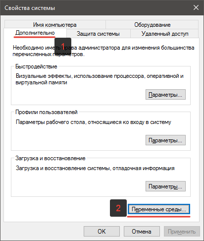
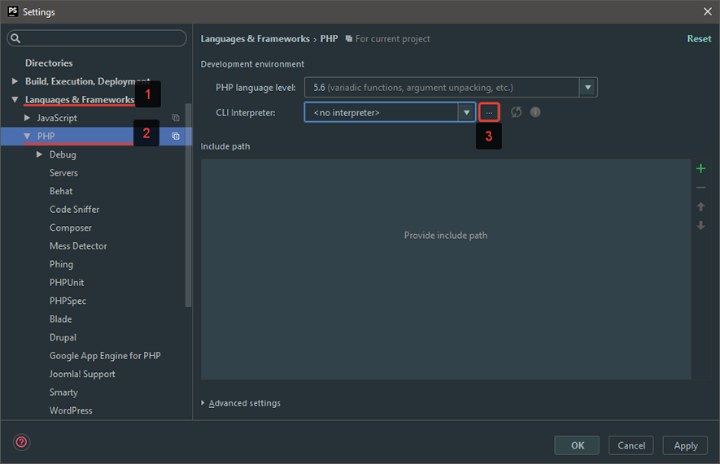
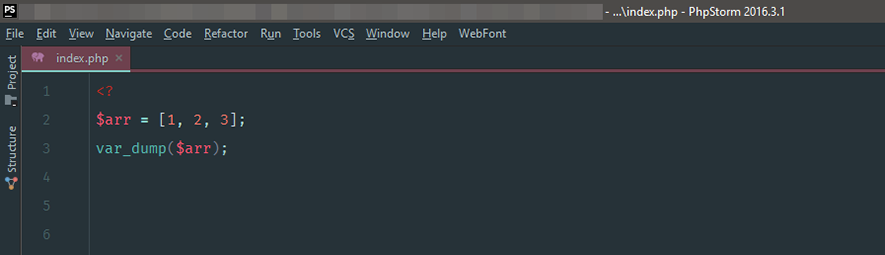
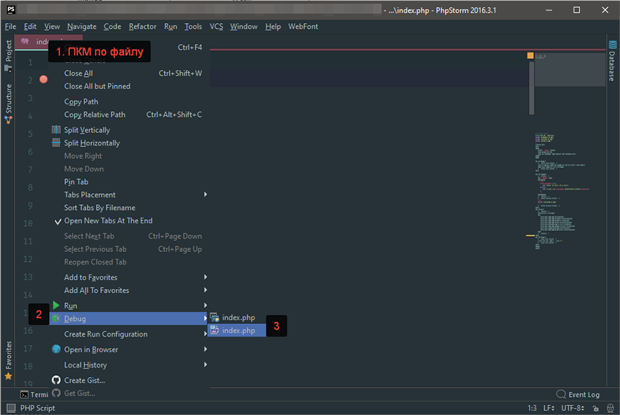

# Xdebug. Установка отладчика (дебагера) PhpStorm для Windows

В этой статье мы рассмотрим возможность подключения интерпретатора PHP, отладчика Xdebug к PhpStorm на OC Windows и использование встроенного в IDE web-сервера.
Начнем с установки отладчика Xdebug в PHP.
## Установка Xdebug
Первым делом убедимся в том, что интерпретатор PHP установлен в систему и доступен, открыв командную строку и введя следующую команду: php -v
Должна появится информация о версии PHP, подобно этой:

>PHP 5.6.26 (cli) (built: Sep 15 2016 18:11:39)  
>Copyright (c) 1997-2016 The PHP Group  
>Zend Engine v2.6.0, Copyright (c) 1998-2016 Zend Technologies  
>with Xdebug v2.4.1, Copyright (c) 2002-2016, by Derick Rethans

**Если этого не произошло, тогда делаем следующее:**
* Скачиваем интерпретатор PHP по ссылке: http://windows.php.net/downloads/releases/php-5.6.29-nts-Win32-VC11-x64.zip и распаковываем его, например, в директорию C:\php
* Далее, нажав правой кнопкой мыши на значке Этот компьютер, выбираем пункт Свойства -> Дополнительные параметры системы

* В открывшемся окне выбираем вкладку Дополнительно, кнопка Переменные среды

* В разделе Переменные среды пользователя ищем переменную PATH. Если её нет, то создаем:
    * Имя переменной: PATH
    * Путь до директории, в которую вы распаковали архив с PHP. В моем случае будет так:
    * Значение переменной: C:\php

* Сохраняем и обязательно перезапускаем консоль!

Теперь можно снова проверить работу PHP командой php -v. Должна вывестись корректно версия PHP, как было показано выше.

Теперь можно перейти к установке отладчика Xdebug, для которого существует специальный помощник, значительно упрощающий процедуру установки. Для его использования перейдем по ссылке:

https://xdebug.org/wizard.php

На этой странице, необходимо ввести в поле ввода информацию об установленном PHP-интерпретаторе, которая генерируется с помощью PHP-функции phpinfo(). Вводить нужно весь скопированный текст со страницы.

Или, введя в консоль команду php -i, которая генерирует информацию о PHP.

Копируем полученную информацию, нажимаем кнопку Analyse my phpinfo() output и получаем инструкцию по установке Xdebug.

В зависимости от вашей версии PHP и пути установки инструкция может отличаться от моей:

Скачиваем библиотеку Xdebug для PHP версии 5.6.19 по ссылке: http://xdebug.org/files/php_xdebug-2.4.0-5.6-vc11-nts.dll

Перемещаем её в папку C:\php\ext

В файл C:\php\php.ini (если такого файла нет, ищем файл файл php.ini-development и переименовываем его в php.ini) находим секцию Dynamic Extensions и добавляем следующую строку:
>zend_extension = C:\php\ext\php_xdebug-2.4.0-5.6-vc11-nts.dll

**Подключение интерпретатора PHP к PhpStorm**

Теперь перейдем в PhpStorm и откроем настройки комбинацией клавиш Ctrl+Alt+S.

Далее, в секции Languages & Frameworks выберем пункт PHP. В этой секции необходимо назначить интерпретатор для IDE в пункте Interpreter нажав на кнопку …

В открывшемся окне, нажимаем на кнопку +, выбираем пункт Other local… в поле Name вводим любое имя для удобства дальнейшей идентификации, например: PHP 5.6.

В поле PHP executable указываем путь до интерпретатора, например: C:\php\php.exe. Обратите внимание на появившуюся версию PHP и дебагера, что свидетельствует о правильности установки.

Чтобы убедиться в том, что правильно отрабатывает подключенный интерпретатор PHP, создадим в PhpStorm новый проект, добавим к нему файл index.php и запишем в этот файл, например, функцию var_dump([ 1, 2, 3 ]) с переданным в нее массивом.

**Работа с отладчиком Xdebug в PhpStorm**

Прежде чем приступить к отладке PHP-скриптов с помощью Xdebug произведем необходимую настройку в файле php.ini. В секции Dynamic Extensions, после подключения расширения Xdebug, добавим следующие настройки:

>xdebug.remote_enable=1
>xdebug.remote_port=9000
>xdebug.profiler_enable=1
>xdebug.profiler_output_dir="c:\php\tmp"

Теперь зайдем в PhpStorm и откроем настройки. Перейдем в Languages & Frameworks -> PHP -> Debug. В секции Xdebug убедимся, что установлены следующие настройки:
   >Debug port: 9000  
   >Установлен флажок Can accept external connections

## Проверка работы отладчика Xdebug
Чтобы проверить, что все действия были проведены верно, создадим в новом проекте файл index.php и напишем следующий код:

И поставим точку остановки на строке с var_dump().

Теперь запустим отладку этого скрипта, нажав правую кнопку мыши и выбрав пункт Debug ‘index.php’.

Если все было сделано правильно, то в PhpStorm появится вывод дебага, как показано на скриншоте.
