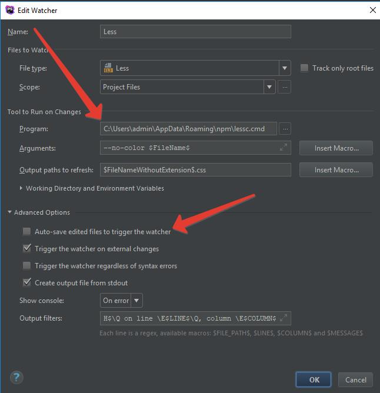

# Компиляция стилей с less в css

## Перед началом
1. Проверте включен ли плагин `File Watchers` в PhpShtorm  
`File -> Settings -> Tools -> File Watchers` or `Ctrl+Alt+S`   
Должен быть включен.
Подробная установка описана в статье [Установка плагина в PhpShtorm](../Compres/CompresJsAndCss.md)
2. Загрузите и установите Node.js https://nodejs.org/en/  
В составе Node.js есть, необходимый для установки less, NPM (node package manager)

## Установка из командной строки в глобальном режиме
1. Откройте командную строку и перейдите в папку, где хранится Node.js, по умолчанию `C:\Program Files\nodejs`.
2. Введите в командной строке следующую команду:  
`npm install -g less`  
  
Теперь less доступен во всех проектах, но не зупущен.

## Запустк less в проекте PhpShtorm
1. В проекте перейдите в главном меню  
    `File -> Settings -> Tools -> File Watchers` or `Ctrl+Alt+S`
2. Нажмите на значок «+», в выпадающем меню выбирите `Less`
3. Настраиваем less  
3.1. Проверяем путь к less, на отсутсвие ошыбок (см. фото2)  
3.2. Убираем галочку `Auto-save edited files to trigger the watcher`  
  
3.3. Сохраняем

## Готово

>**Полезно**  
>* *Подробная инструкцыя по установке от jetbrains*
https://www.jetbrains.com/help/phpstorm/compiling-sass-less-and-scss-to-css.html  
>* *Введение в Less синтаксис* (начиная с пункта "Укрощаем мощь LESS") https://habrahabr.ru/post/136525/

> **На заметку**   
На даном етапе каждый правленый (после устновки less) less-файл будет компилироваться в css-файл с таким же названием. Файлы можно обьеденять, минимизировать... Использовать less на полную