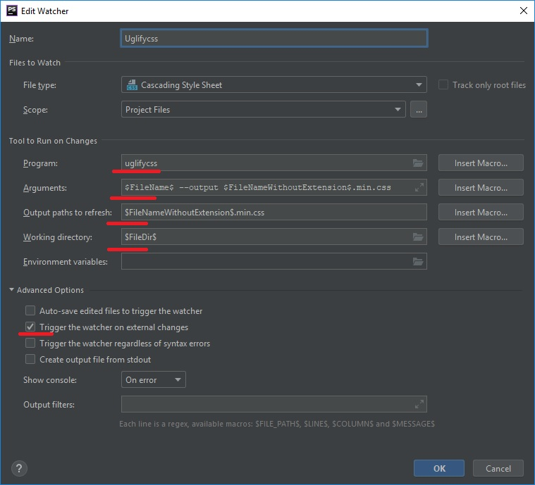

# Сжатие стилей Uglifycss

## Перед началом
1. Проверить включен ли плагин `File Watchers` в PhpShtorm  
`File -> Settings -> Tools -> File Watchers` or `Ctrl+Alt+S`   
Должен быть включен.
Подробная установка описана в статье [Удобный плагин для PhpShtorm, который создает сжатую копию файлов js и css](../Compres/CompresJsAndCss.md) пункт "Установка плагина в PhpShtorm"  
2. Загрузить и установить Node.js https://nodejs.org/en/  
В составе Node.js есть, необходимый для установки less, NPM (node package manager)

## Установка из командной строки в глобальном режиме
1. Открыть командную строку и перейдите в папку, где хранится Node.js, по умолчанию `C:\Program Files\nodejs`.
2. Ввести в командной строке следующую команду:  
`npm install uglifycss -g`  
Теперь uglifycss доступен во всех проектах, но не зупущен.

## Запуск uglifycss в проекте PhpShtorm
1. В проекте перейти в главном меню  
    `File -> Settings -> Tools -> File Watchers` or `Ctrl+Alt+S`  
2. Наажть на значок «+», в выпадающем меню выбрать `Custom`
3. Настройка uglifycss  
3.1. Проверте путь к uglifycss, на отсутсвие ошыбок, может отличаться (можно просто прописать uglifycss)  
    `C:\Users\hp\AppData\Roaming\npm\uglifycss.cmd`  
3.2. Настройка параметров  
Arguments: `$FileName$ --output $FileNameWithoutExtension$.min.css`  
Outpup paths to refresh:`$FileNameWithoutExtension$.min.css`  
Working directory: `$FileDir$`  
3.3. Удаление галочки
    `Auto-save edited files to trigger the watcher`  
  

3.3. Сохранить

## Готово

>**Полезно**  
>* *Подробная инструкция по установке*
https://www.npmjs.com/package/uglifycss  
