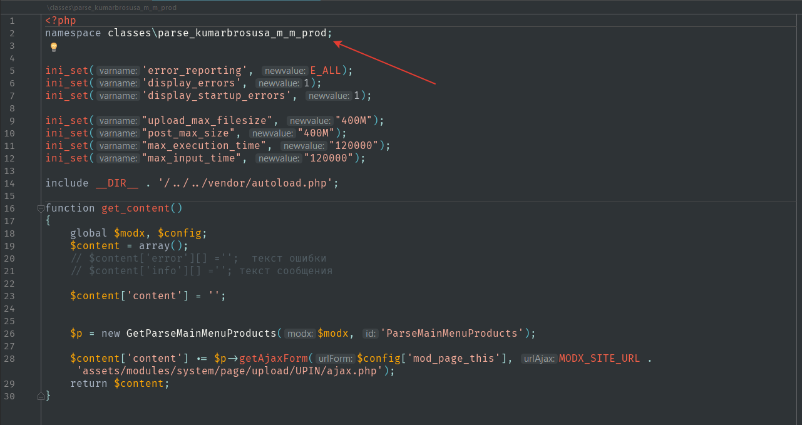
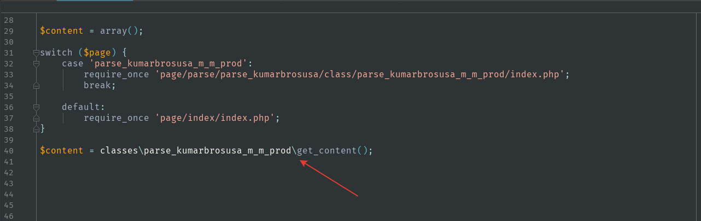
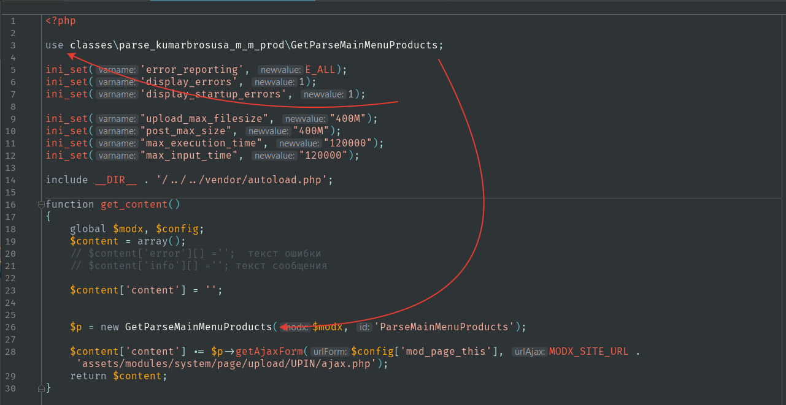
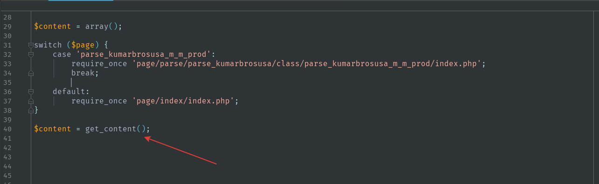

В любой программе которую мы проектируем, обязательно есть главный файл, в котором все подключается или производится запуск.  
Если в проекте мы используем пространиства имен, то рекомендуется етот файл не заносить под пространиство имен, поскольку в дальнейшем программа которую мы напишем, может быть интегрирована в другую программу, которая не использует пространиство имен. И при интеграции могут возникнуть проблемы, потому что зачастую этот главный файл подключается не в глобальной видимости, а в какой нибудь конструкции switch case, и получется что пространство имен будет обьявлено в этой конструкции а ето не допустимо. И если после подключения такого файла мы попытаемся вызвать функцию которая в нем обьявленная, интерпритатор ее не увидит и выдаст ошибку.  

### Например:  
В файле `index.php` мы подключаем файл `page/parse/parse_kumarbrosusa/class/parse_kumarbrosusa_m_m_prod/index.php` в котором есть функция `get_content()`.  
После чего вызываем ее.  

### Плохо  
Файл `page/parse/parse_kumarbrosusa/class/parse_kumarbrosusa_m_m_prod/index.php`  
  
Файл `index.php`  
  

### Хорошо  
Если в основном файле мы не обьявим пространство имен, это нам никак не помешает, а если нужно будет использовать класс или функцию которое находится в пространстве имен, нам всего лишь нужно будет в верху страницы использовать оператор `use`  

Файл `page/parse/parse_kumarbrosusa/class/parse_kumarbrosusa_m_m_prod/index.php`  
  
За то теперь при подключении файла с помощью switch case нам не нужно будет городить разное пространиство имен при вызове функции `get_content()` в зависимости от того, какой файл был подключен.  

Файл `index.php`  
  

**Продолжение следует ...**
