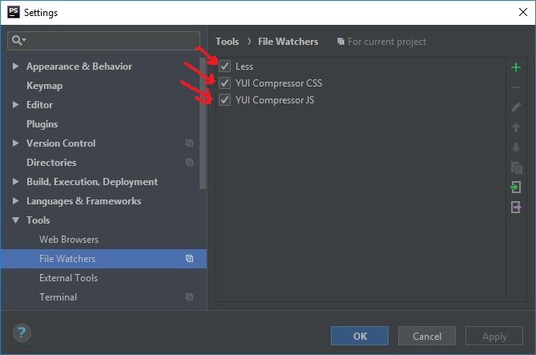
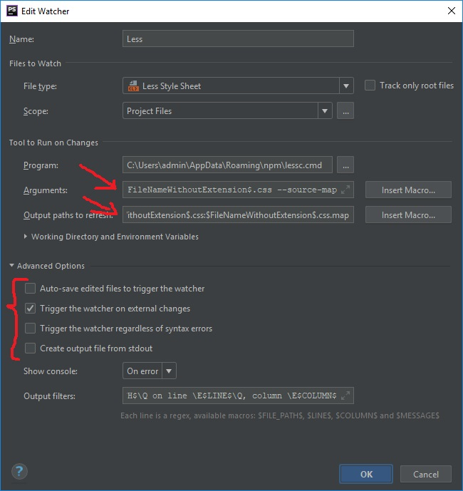
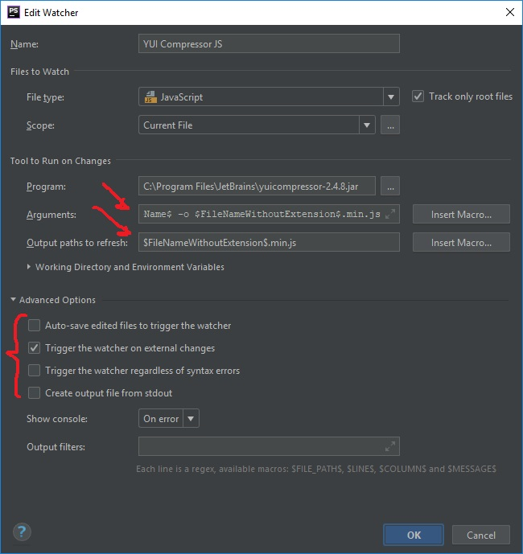

# Настройка File Watchers для удобной компиляции less в css, css в min.css и js в min.js

## Установка и обновление компилятора Less

Открыть терминал (View | Tool Windows | Terminal) и запустить команду **npm install --global less** 

  

## Указать параметры Arguments и Output path to refresh
### 1. LESS 
 
OLD  
 Arguments = `--no-color $FileName$`  
 Output path to refresh = `$FileNameWithoutExtension$.css`

NEW  
 Arguments = `$FileName$ $FileNameWithoutExtension$.css --source-map`  
 Output path to refresh = `$FileNameWithoutExtension$.css:$FileNameWithoutExtension$.css.map`

  

### 2. YUI Compressor CSS  

NEW  
 Arguments = `$FileName$ -o $FileNameWithoutExtension$.min.css`  
 Output path to refresh = `$FileNameWithoutExtension$.min.css`

### 3. YUI Compressor JS

NEW  
 Arguments = `$FileName$ -o $FileNameWithoutExtension$.min.js`  
 Output path to refresh = `$FileNameWithoutExtension$.min.js`

>**Еще**  
Compiling Sass, Less, and SCSS to CSS: https://www.jetbrains.com/help/phpstorm/transpiling-sass-less-and-scss-to-css.html  
Using File Watchers: https://www.jetbrains.com/help/phpstorm/using-file-watchers.html