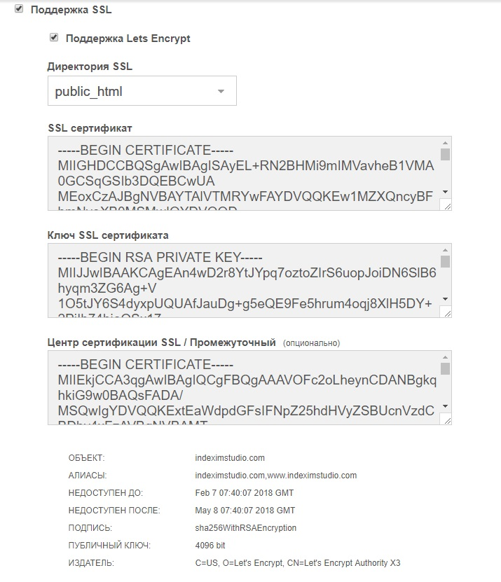

# Перевод сайта с HTTP на HTTPS

Если на сайте есть защищенный сертификат (SSL), можно автоматически перенаправлять посетителей на защищенную (HTTPS) версию сайта, чтобы убедиться, что их информация защищена.

Нужно виполныть дейстивия в админке хостинга, админке сайта и в .htaccess.

## 1. Админка хостинга

В редактировании домена включить поддержку SSL:



## 2. Админка сайта

Конфигурацыя -> Сайт -> Тип сервера  `https`


## 3. Конфигурацыонный файл .htaccess

Расскомментировать или добавить настройки

```
#redirect http to https
RewriteCond %{SERVER_PORT} !^443$
RewriteRule .* https://%{SERVER_NAME}%{REQUEST_URI} [R=301,L]
```

Заполнить `example.com`

```
# without www
RewriteCond %{HTTP_HOST} .
RewriteCond %{HTTP_HOST} !^example\.com [NC]
RewriteRule (.*) https://example.com/$1 [R=301,L]
```
