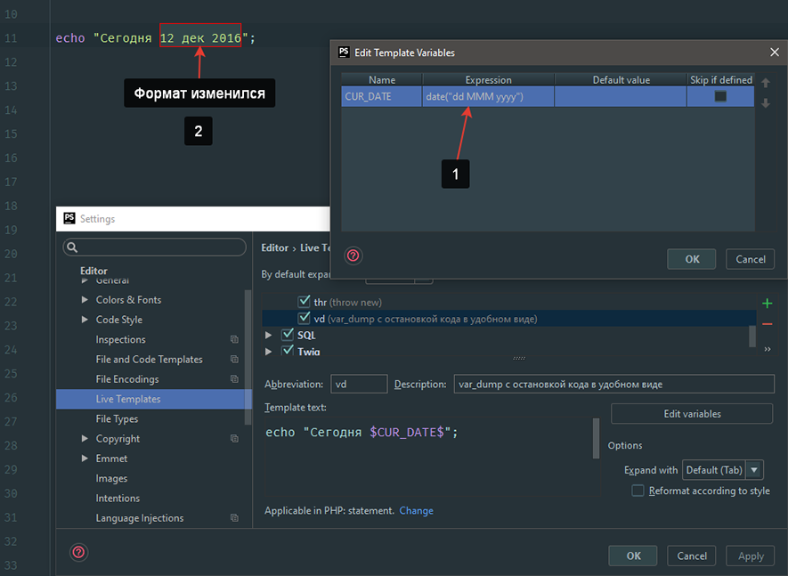

# Live Template. Создание шаблона кода

## Зачем нужен Live Templates
Live Templates позволяют вставлять часто используемый код быстро, качественно, и аккуратно. Чтобы развернуть фрагмент кода, введите соответствующий шаблон код шаблона и нажмите Tab. Используя Tab можно быстро переходить от переменной к переменной в шаблоне, если их больше одной.    
**Простой Live Templates**  
Live Templates содержат фиксированный код, который вставляется в виде обычного текста при вызове заменяя аббревиатуру.  
**Live Templates с параметрами**  
Live Templates с параметрами содержит обычный текст и переменные, которые позволяют пользователю быстро и удобно заполнять вставленный шаблон.

После того, как шаблон вставляется, в местах переменных редактор выводит подсказки переменных или вычисляется автоматически самим редактором в зависимости от типа указанной переменной в шаблоне.
## Использование Live Templates
Вставить шаблон можно несколькими способами:  
**С помощью комбинации клавиш Ctrl+J**  
В нужном месте документа нажмите комбинацию клавиш Ctrl+J. Откроется список предложений шаблонов для текущего языка в котором вы можете увидеть короткое имя шаблона и его описание. После чего просто выберите нужный вам шаблон.  
Обратите внимание что список предложений может содержать одинаковые аббревиатуры для нескольких шаблонов.
  
Когда открыт список шаблонов нажмите комбинацию клавиш Ctrl+Q чтобы увидить краткую документацию к выбранному шаблону.

**Набрать имя шаблона (аббревиатуру)**  
Введите имя шаблона и выберите нужный шаблон со списка подсказок или просто нажмите Tab, после чего редактор заменит имя на содержимое шаблона и установит курсор в место где указана переменная.  
Если выбранный содержит переменные и требует ввода данных пользователем, редактор переходит в режим редактирования шаблона и устанавливает курсор в первом поле ввода подсвечивая его красной рамкой. Введите значение в это поле и нажмите клавишу Enter или Tab, чтобы завершить ввод и перейти к следующему полю ввода. После заполнения последнего поля ввода, курсор перемещается в конец конструкции, и редактор возвращается в обычный режим работы.  
**Окружение блочного кода с Live Template**

1. В редакторе выберите участок кода, который хотите окружить в Live Templates.
2. Выполните одно из следующих действий:
    * В главном меню выберите Code -> Surround With Live Template....
    * Нажмите Ctrl+Alt+J.
3. Выберите нужный шаблон из списка предложений.  
Выделенный участок кода обернётся шаблоном, курсор установится в первое поле ввода, а второе будет заполнятся автоматически.

## Просмотр списка шаблонов Live Templates
Откройте окно настроек. В основном меню программы перейдите File -> Settings…, или нажмите комбинацию клавиш (Ctrl+Alt+S).  

Далее перейдите Editor -> Live Templates.    
В правой части экрана вы можете ознакомиться со списком готовых шаблонов. Шаблоны разбиты по группам.

## Создание шаблона Live Templates
1. В правой части окна нажмите на кнопку +. У вас будет возможность выбрать:
    * Live Template – создание шаблона
* Template Group… - создание новой группы для шаблонов
2. Выбираем пункт Live Template. Создастся новый шаблон, в котором нам нужно будет заполнить следующие поля:
    * Abbreviation. Имя шаблона (с помощью него будет вызываться шаблон)
    * Description. Описание шаблона
    * Template text. Собственно, сам шаблон  
    
После того как шаблон будет вставлен в документ, его переменные будут представлены представлены в качестве полей ввода. Значения этих полей могут быть либо заполнены пользователем или рассчитываться редактором.  
    
    Чтобы это было сделано автоматически, для каждой переменной нужно знать следующее:
        Выражение вычисляется в ассоциации с переменной  
        Значение по умолчанию должно быть заполнено для того чтоб оно вывелось если редактору не удастся произвести расчёты.  
        Порядок, в котором Phpshtorm будет обрабатывать поля ввода после вставки шаблона, определяется порядком переменных в списке редактирования переменных шаблона.

## Настройка переменных, используемых в шаблоне
Откройте окно редактирования шаблона, справа от поля Template text нажмите кнопку Edit variables (если в шаблоне присутствует по крайней мере одна пользовательская переменная переменная, т. е. переменная отличается от $END$ или $SELECTION$). Откроется новое диалоговое окно, где можно определить, как переменные будут обрабатываться при использовании шаблона.

Заполните следующие поля:

* Expression. Поле, в котором указывается выражение, с помощью которого редактор выведет результат.  
* Default value. Значение, которое выведется если редактору не удастся получить результат выражения.  
Чтобы расположить переменные в том порядке в котором вы хотите их редактировать при заполнении шаблона, используйте стрелки Вверх и Вниз.
## Пример использования функции в переменной
Создадим шаблон, который выводит текущую дату. Для этого в поле редактирования переменной Expression из списка выберем функцию date().

Так же можно изменить формат вывода даты, если передать в функцию параметры.
