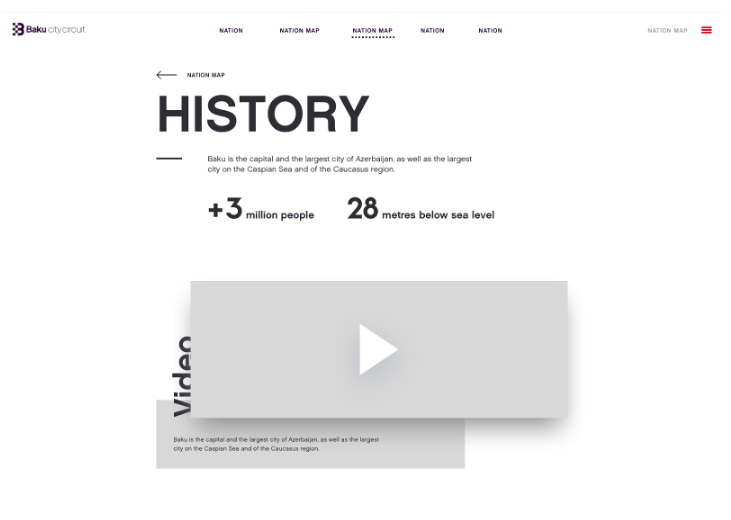
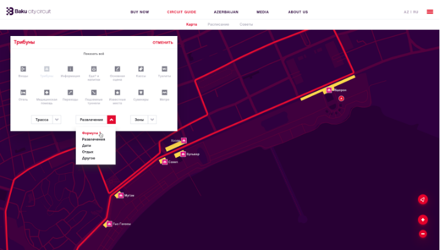
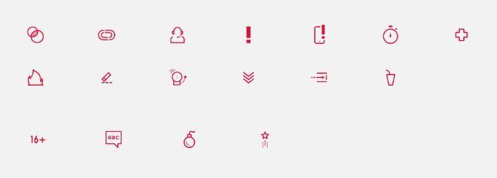

 # 8. Дизайн

## Изучение материалов

Основные материалы:

- клиентский бриф;
- техническое задание;
- брендбук компании.
Дополнительные материалы:

- фотографии компании, буклеты, видео и пр.

Изучение сайтов конкурентов и сайтов схожей тематики.

От заказчика может поступить прототип будущего проекта. Если прототипа нет, то, в зависимости от сложности проекта, принимается решение о его создании.

## Создание прототипов

Через специализированные сервисы, стандартные графические редакторы или просто карандашом на бумаге создаются все основные экраны.

## Сервисы для прототипирования

- InVision
- Justinmind
- Flinto
- Origami
- Pixate
- Moqups

Для разработки интерактивных прототипов дизайнеры Студии используют InVision и Flinto.

Сервис позволяет связать готовые изображения анимированными переходами, которые можно протестировать на мобильных устройствах.

Из интересных функций стоит отметить синхронизацию с Dropbox, поддержку планшетов, встроенную анимацию переходов, простой интерфейс, быструю отправку ссылок на прототипы по SMS, а также возможность посмотреть прототип не только с мобильных устройств, но и в браузере.

Сервис имеет веб-интерфейс, но есть десктоп-версия для операционной системы MacOS, с расширенными возможностями визуализации.

## Концепция основной страницы

## Концепция внутренней страницы

Основная страница чаще всего стартовая. В случае с интернет-магазином это может быть страница каталога.

В Студии дизайн разрабатывается в программе Adobe Photoshop (результат — файл с расширением.psd).

Другая популярная программа для проектирования интерфейсов — Sketch. Дизайнеры Студии не используют Sketch по ряду причин, хотя мы считаем, что это отличная программа для дизайна. Одной из причин является то, что переход затронет сразу множество специалистов, также нужно учитывать, что заказчики не всегда смогут принять исходники в скетче, и придется проделывать лишнюю работу для переноса.

Первым этапом накидываются все основные блоки страницы и происходит работа над поиском уникального стиля (иногда необходимо точное соответствие устоявшемуся стилю).

Состав стиля сайта:

- цветовая гамма;
- сетка сайта (расположение блоков относительно друг друга);
- набор шрифтов;
- графические элементы (фотографии, иконки и пр);
- формы ввода;
- анимация.
На сайте могут присутствовать интерактивные элементы, для их представления заказчику рисуется раскадровка ключевых кадров или создается видеопрезентация.

После утверждения главной и внутренней страниц происходит тиражирование стиля на остальные страницы.

## Дополнительные страницы

Имея основной набор стиля сайта, специалист рисует весь комплект страниц будущего сайта.

## Адаптация под мобильные устройства

Параллельно с внутренними страницами отрисовываются мобильные и планшетные версии. Чтобы оптимизировать процесс работы, для frontend-разработчиков не готовят абсолютно все страницы в нескольких разрешениях, а лишь типовые и примеры отдельных более сложных элементов.

Тестирование адаптивных версий или дизайна мобильных приложений необходимо проводить сразу на устройстве.

## Дополнительные элементы

На заключительном этапе подготавливается набор недостающих элементов: фавиконки, страницы ошибок и пр.

Дизайнер обязан отслеживать этапы верстки и заполнения контентом и, при необходимости, вносить корректировки в макеты.