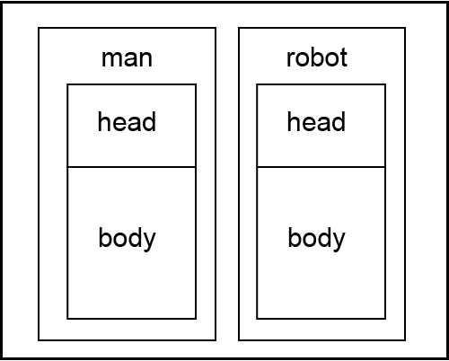

# 10. Верстка / Frontend-разработка

Любая веб-страница работает на основе трех языков/технологий:
HTML (язык разметки гипертекста), CSS (каскадные таблицы стилей) и JavaScript.

## HTML

Язык, используемый для разметки размещаемого контента. Описывает структуру страницы (блоки, заголовки, тексты, ссылки и т. д.) с помощью специальных HTML-тегов. Например, для создания ссылок используется тег <a>, а для добавления изображения — .

## CSS

Язык для стилизации веб-страниц. Используется, чтобы задать размеры и расположение блоков, цвета фона и текста, шрифтов и т. д. Позволяет описывать простые анимации (например, плавно показать тень у блока при наведении на него). Имеет удобные средства для смены стилей при изменении размеров экрана, позволяя реализовывать большую часть адаптивности.

## JavaScript

Язык для реализации интерактива на странице, расчетов, логики и анимаций. Позволяет динамически менять HTML и CSS, выполнять операции в зависимости от действий пользователя. Исполняется в браузере посетителя сайта (зависит от мощности устройства посетителя сайта, а не мощности сервера / хостинга на котором размещен сайт).
