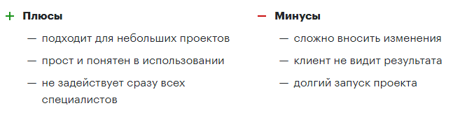

# 4. Управление проектами

## Принципы работы менеджера проектов

### Взаимодействие с клиентами

Быть одинаково тактичным при переписке с любым человеком при любых обстоятельствах.

Ответ на письмо клиента должен быть отправлен в течение 15 минут. Если подготовка ответа занимает больше 15 минут, нужно отписаться, когда будет ответ. Обязательно вернуться с ответом в оговоренный срок.

Смета по проекту должна быть отправлена в течение суток с момента обращения. Исключение — сложные проекты с привлечением подрядчиков.

В почте должна быть включена функция отмены отправки сообщения. Необходимо перечитывать каждое письмо перед отправкой, проверять адресатов, их имена, тему письма, наличие приложений (если об этом упоминается в теле письма). После отправки в течение 10 сек нужно еще раз пробежаться по тексту.

Если письмо прочитано — должно быть выполнено какое-либо действие. Действие необходимо выполнить сразу, не отвлекаясь ни на какие задачи. Если нет возможности выполнить действие, нужно пометить письмо как непрочитанное.

Действие по письму должно инициировать обратную реакцию. Например, должна быть поставлена задача в системе управления проектами. Через какое-то время задача будет закрыта исполнителем — это и будет реакцией. В идеале обратная связь должна поступить и от клиента, и от исполнителя.

Нельзя отвечать на не до конца понятные вопросы, прежде нужно уточнить все неизвестные. Первое время стоит спрашивать сначала у коллег, потом у клиента.

Нельзя гарантировать того, в чем нет стопроцентной уверенности.

Если не получается сформулировать ответ или вопрос в письме — следует позвонить клиенту, обсудить все голосом.

Если клиент неправильно понял смысл сообщения уже два раза подряд — следует позвонить клиенту, обсудить все голосом.

Если клиент не ответил на два последних письма, требующих ответа — следует позвонить клиенту, обсудить все голосом.

Наши клиенты отлично понимают техническую сторону вопроса. Если нет уверенности в техническом аспекте — прежде, чем обсуждать его с клиентом, нужно попросить исполнителя все описать обычным, не техническим языком.

Если клиент сообщил об ошибке — значит, ошибка есть. Нужно дважды проверить работу на предмет ошибок. Если специалист говорит, что ошибки нет — пусть проверит еще раз.

Если клиент сообщил об ошибке — приступить к устранению ошибки нужно немедленно.

Если ошибка имела место — необходимо извиниться перед клиентом и впредь контролировать результат тщательней.

Необходимо обсуждать и фиксировать с клиентом сроки оплаты в начале проекта.

Если клиент сообщает о задержке платежа, нужно уточнить, с чем это связано, и попросить по возможности ускорить процесс.

### Взаимодействие со штатными специалистами

Важно быть всегда вежливым и тактичным, уважать каждого специалиста.

Решения руководителя проектов должны исполняться, не следует ввязываться в спор по поводу принятых решений.

Решения должны быть последовательны, нельзя допускать противоречий.

Постановка задач должна быть точной. Нельзя допускать размытых формулировок.

Нельзя передавать специалистам настроение заказчика, нельзя давить на них, если клиент нагнетает атмосферу.

Запрещено связывать напрямую клиента и исполнителя. Общение происходит только через менеджера.

Менеджер всегда должен знать, чем занят каждый специалист.

Следует сообщать специалисту удобные вам сроки, а не сроки клиента. Не следует называть клиенту сроки, озвученные специалистом.

Необходимо контролировать соблюдение озвученных специалисту сроков.

Если проект должен быть сдан сегодня — исполнитель должен доделать его сегодня. Если нужно задержаться — нужно задержаться.

Всегда детально обсуждать допущенные специалистом ошибки.

Ту-ду должны закрываться сразу после завершения задачи.

Неактивные проекты должны быть архивированы.

### Взаимодействие с партнерами

**Все подрядчики Студии являются партнерами. Кроме приведенных ниже тезисов, учебное пособие содержит отдельный раздел «Работа с партнерами».**

Важно быть всегда вежливым и тактичным, уважать каждого партнера.

Решения руководителя проектов должны исполняться, не следует ввязываться в спор по поводу принятых решений.

Решения должны быть последовательны, нельзя допускать противоречий.

Постановка задач должна быть точной. Нельзя допускать размытых формулировок.

Нельзя передавать партнерам настроение заказчика, нельзя давить на них, если клиент нагнетает атмосферу.

Запрещено связывать напрямую клиента и партнера. Общение происходит только через менеджера.

Менеджер всегда должен знать, чем занят партнер.

В начале обсуждения каждого проекта нужно удостовериться, что исполнитель сохранит конфиденциальность обсуждения.

Следует строить доверительные отношения с партнером.

Необходимо обсуждать все условия до начала работы. Если нет возможности — нужно фиксировать условия поэтапно и добиваться фиксации примерных условий на последующие этапы.

Скидывать задачи на оценку нужно хотя бы 2 партнерам. Допускается отдать проект надежным подрядчикам в случае высокой важности и срочности без этапа брифинга нескольких исполнителей.

Называть сроки нужно с существенным запасом до дедлайна — до 50% от зафиксированных с клиентом сроков.

Исполнитель должен ставить наш проект в приоритет.

Необходимо добиваться соблюдения обязательств. Исполнитель должен выполнить все обязательства до того, как будет проведена оплата.

В начале каждого дня нужно фиксировать объем работы на день.

Следует устанавливать микротайминги на протяжении дня.

Если дополнительно не оговорено, то конец дня — это 18:00. То, что должно быть сдано сегодня — должно быть сдано к 18:00. Все, что позже — это завтра.

### Самостоятельная работа

Нужно планировать свой день.

Принимать решения нужно быстро вне зависимости от отведенного на это время.

Задачи должны быть зафиксированы в таск-менеджере.

Следует разбивать задачи по срокам выполнения. Приоритет задач — не только по важности, но и по количеству свободного времени.

Необходимо расписывать (не копировать) для себя информацию о проекте в отдельном документе, так легче найти сомнительные моменты.

Необходимо продумывать и расписывать риски проектов.

Нужно планировать стратегию на случай наступления рисков.

При возникновении проблемы, главное — найти решение, а не виновного.

Нельзя скрывать свои ошибки, нужно озвучивать и находить решение.

Необходимо фиксировать все устные договоренности в переписке.

Нужно всегда обдумывать задачу от клиента, прежде чем передать ее исполнителю, даже если это просто комментарий.

## Методологии разработки (краткий обзор)

Существуют отличные книги, детально рассматривающие разные методологии разработки. Мы не видим смысла в переписывании этого материала. Вместо этого, приводим две основные модели разработки в ознакомительных целях. Принципиальное отличие которых в длине итераций, наличии или отсутствии владельца продукта (product owner), а также наличии условно готового продукта на каждом из этапов.

### Каскадная (водопадная) модель разработки Waterfall

Waterfall — подход к процессу разработки, при котором каждый новый этап работы начинается после завершения предыдущего.

### Гибкая методология разработки Agile

Agile — итерационная модель разработки, когда работа проходит короткими спринтами, результатом каждого из которых становится продукт определенной степени готовности.

Плюс метода в том, что на каждом из этапов есть работающий продукт, который постепенно дорабатывается.

Замечание автора про agile в заказной разработке. В подавляющем большинстве случаев агентство ведет разработку клиентского проекта у себя в офисе, а бренд-менеджер со стороны клиента, отвечающий за разработку и развитие проекта — у себя. В этом случае не существует роли владельца продукта, так как бренд-менеджер не является частью команды разработки и не имеет возможность лично обсуждать каждое изменение в проекте. Говорить об agile в этом случае не представляется возможным.

Агентство может говорить о том, что работает по agile только в том случае, если команда разработки находится в офисе клиента и ее непосредственным участником является владелец продукта со стороны клиента. Студия Чулакова работает с рядом клиентов по данной модели, разрабатывая сложные технические решения в офисе заказчика.