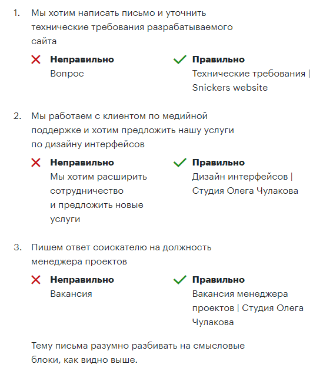
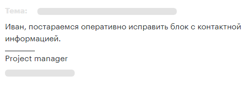

# 2. Корпоративная переписка

### Переписка формирует впечатление клиента, коллеги или будущего работодателя о вас

По тому, как вы пишете письма и сообщения в мессенджерах, собеседник судит о вашей адекватности и проф. пригодности. Если вы безалаберны в переписке, вас будут воспринимать, в лучшем случае, как новичка. Если ваши письма идеальны с точки зрения логики, структуры, грамотности и типографики — вы будете производить положительное впечатление.

## Редакционная политика Студии

Упрощает написание и понимание текстов, спасает от ошибок и лишних букв.

### Стилистика

Все тексты, опубликованные на страницах Студии, написаны человеческим языком.

Сложность текста обусловлена только его практической применимостью: если сложные технические подробности можно опустить, мы о них не пишем.

Термины и аббревиатуры мы объясним и расшифруем.

Мы не пишем в страдательном залоге.

### Структура текстов

Тексты строятся по принципу перевернутой пирамиды: информация должна быть упорядочена по важности и полезности для читателя.

#### Заголовок

Отражает суть сообщения. Для новостной ленты сайта это короткое предложение с глаголом в прошедшем времени (глагол «быть» можно опустить), для подач — название проекта, для писем — тема беседы.

#### Основной текст

Не длиннее 6 абзацев. Один абзац — одна мысль. Общий объем текста не более 5 000 знаков с пробелами.

Каждое суждение или оценка должны быть аргументированы примерами или ссылками на экспертов. Выступая в качестве экспертов, мы не выражаем свое мнение в грубой форме и готовы его аргументировать.

### Оформление

Тексты создаются в Google Docs. Используются только стандартные стили:

- Title для основного заголовка. Документ может содержать только один заголовок Title.
- Названия глав выделяются заголовком верхнего уровня Heading 1.
- Заголовки любого уровня не должны заканчиваться знаком препинания: точка после заголовка не ставится.
- В тексте не должно быть форматирования пробелами.
- До и после заголовков не должно быть перевода (разрыва) строки с помощью клавиши Enter. Заголовки уже имеют необходимые отступы.
- Нельзя увеличивать или уменьшать кегль текста. Текст всегда пишется шрифтом Arial 11 кегля. Если возникает желание увеличить размер кегля — используйте подзаголовки.
- Если необходимо выделить мысль, можно использовать стиль Subtitle
- Для акцента в тексте можно использовать курсив или полужирное начертание. Таким образом можно выделять одно-два слова. Нельзя выделяться полужирным целые предложения.
- Выделять полужирным курсивом слова запрещено. Нельзя выделять текст цветом.

### Обращение к пользователю

Мы обращаемся к пользователю на «вы». В электронных письмах после приветствия обязательно обращение к адресату или коллегам, если вы не уверены в том, кто прочтет письмо.

Мы не используем вопросительные конструкции и повелительное наклонение в диалоге с пользователем.

### Орфография, синтаксис, пунктуация

Когда речь идет о нас, мы пишем Студия с заглавной, потому что это часть названия.

Местоимение «вы» пишется со строчной во всех случаях. Излишний пафос ни к чему.

Мы не используем множественные точки или скобки.

## Способы переписки

Студия рекомендует использовать для рабочей переписки корпоративную электронную почту и мессенджеры Telegram и Slack или Skype. Рабочая переписка во «ВКонтакте» запрещена. Будьте готовы в любой момент предоставить рабочую переписку по требованию непосредственного руководителя.

## Рабочая и личная переписка

Не смешивайте рабочую и личную переписку. Не используйте корпоративную почту в личных целях.

## Обнародование переписки

В любой момент клиент или коллега может обнародовать вашу переписку — передать в суд или опубликовать в публичном доступе. Любые устные договоренности испарятся в тот же момент. Вы будете выглядеть ровно так, как выглядят ваши сообщения.

## Грамотная письменная речь

Наличие орфографических и пунктуационных ошибок, в том числе опечаток, недопустимо. Если вы не уверены в тексте письма, то его следует проверить в текстовом редакторе, например, Яндекс.Спеллер или Грамота.ру. Это касается и писем на английском языке. Используйте словари и переводчики для проверки текста.

## Знаки препинания

Предложения начинаются с прописной буквы и заканчиваются точкой. Нельзя ставить две, три или большее количество точек. Если сообщение имеет особо радостный или значимый характер, после обращения ставится восклицательный знак.
Пример: С днем рождения, Антон!
Нельзя разделять слова больше чем одним пробелом. Сразу после последнего слова в предложении ставится знак препинания: точка, восклицательный знак и пр. Нельзя отделять точку от последнего слова пробелом.
Запрещено использовать два, три и бОльшее количество восклицательных знаков подряд, любое количеством скобок подряд: «)))))" знаки препинания, вида: ! / ? / ?! / !? / !.. / !. / ?.. / ?!. и любое другое подобное сочетание знаков препинания. Многоточие также запрещенный символ.

## Стиль текста

Не следует использовать разные шрифты, подчеркивание, курсив и т. д. Если вы скопировали текст в тело письма, следует удалить форматирование.

## Неформальное общение

Неформальное общение неуместно в деловой переписке. Не используйте сленг, жаргон и афоризмы. Не используйте P. S. Постскриптум воспринимается получателем как неформальное дополнение или неспособность грамотно продумать содержание письма. 
Использование смайликов допускается только в ответ на смайл клиента (не больше одного в письме).

## Оперативность

Ответ на письмо клиента должен быть отправлен в течение 15 минут. Если подготовка ответа занимает больше 15 минут, нужно отписаться о причине задержки и предполагаемом времени ответа. Обязательно ответить в обещанный срок.

## Цепочка писем и тема

Цепочка писем — набор сообщений в рамках одной темы. Четко формулируйте тему письма. Тема письма в рамках одной дискуссии или одного проекта создается один раз. Нельзя отвечать человеку, меняя тему письма и создавая лишние цепочки писем.

Тема должна передавать суть сообщения.

#### Примеры

## Пересылка

Если вы пересылаете клиенту письмо коллеги или подрядчика, следует удалить пометку «Re» и контактные данные из пересылаемого сообщения (см. пример ниже):

Также следует удалить подпись с контактными данными специалистов Студии или подрядчиков.

## Структура письма

### Приветствие

Начните с приветствия (в первом за день письме) и персонального обращения. Если послание предназначено нескольким адресатам, используйте обращение «Коллеги».

#### Примеры

> Юрий, приветствую.

> Анна, добрый день.

> Доброе утро, Андрей.

> Коллеги, добрый вечер.

> Здравствуйте, Владимир.

Запрещено использование выражения «Доброго времени суток». У получателя такого сообщения складывается ощущение, что он общается с роботом. Если вы отправляете письмо вечером с текстом «Добрый вечер», а клиент прочитает его следующим утром, ничего страшного не произойдет.

Если вы пишете человеку, чтобы рассказать особо радостную новость, то можно использовать конструкцию вида:

>Уважаемый Антон!

Приветствие отделяется пустой строкой.

Если вы ведете переписку в течение дня, хорошим тоном является упоминание имени адресата в начале письма. После имени ставится запятая, следующее слово начинается со строчной буквы.

### Вводная часть

Если вы пишете собеседнику через несколько дней с момента последнего письма, например, в понедельник после выходных, разумно напомнить одним предложением, о чем ранее шла речь.

### Основной текст

Суть сообщения.

### Концовка

Будем ждать информацию от вас.
Будем рады ответить на любые вопросы.
и пр.

Отделяется от подписи двумя пустыми строками.

### Подпись

В подписи к письму укажите ваши имя, должность, а также дополнительные контактные данные. Например, телефон для более оперативной связи.

Пример оформления письма с коротким сообщением:

Если письмо содержит длинное сообщение, имя адресата лучше вынести в часть приветствия, отделив от основного сообщения пустой строкой.

Пример оформления письма с длинным сообщением:

## Правило пустого инбокса

Важное правило работы с электронной почтой — правило пустого инбокса. Его суть — в правильном отношении к письмам.

Во входящих всегда только непрочитанные сообщения. Каждое непрочитанное письмо — это задача, требующая решения посредством конкретного действия: ответа на письмо, пересылки, игнорирования с последующим архивированием, отправки в спам и пр.

После выполнения действия (например, ответа на письмо), его необходимо архивировать. Не бойтесь архивировать цепочки писем — с каждым новым входящим письмом, цепочка снова возвращается в инбокс, она никуда не теряется при архивировании. В архиве находятся все письма, к которым были применены необходимые действия, т. е. решенные задачи. Нерешенные, требующие действия, непрочитанные сообщения — во входящих.

Такой подход позволяет навести порядок в почте и не тратить время на поиск актуальных задач (непрочитанных писем). Необходимо стремиться к тому, чтобы инбокс (папка входящих писем) всегда был пустым.

## Настройки доступа

Если к письму нужно прикрепить файл из Google Drive или отправить ссылку на Google Doc, сначала открываем доступ для получателя и только после этого отправляем письмо.